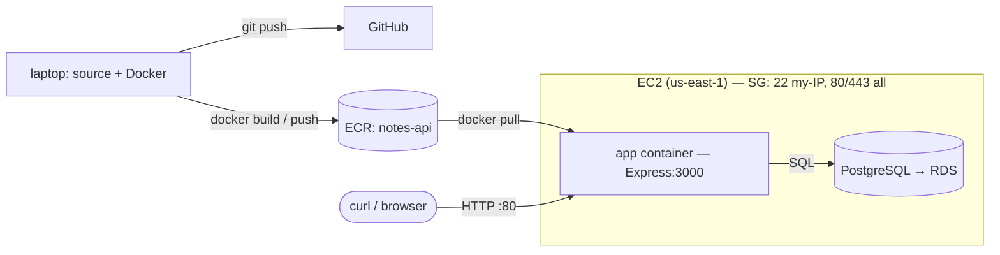

# Architecture


Two views: how the code becomes a running artifact (**delivery**), and how a request
flows when it runs (**runtime**). The runtime side is the *target* we build manually
in Week 5.


## Diagram (target)


```text
  DELIVERY (build & ship)              RUNTIME (target — Week 5)
  ────────────────────────            ────────────────────────────────


  laptop                              client (curl / browser)
  ┌──────────────┐                             │  HTTP :80
  │ source + git │──push──► GitHub             ▼
  │   + Docker   │                    ┌───────────────────────────────┐
  └──────┬───────┘                    │ EC2 instance (us-east-1)      │
         │ docker build               │ SG: 22 ← my IP, 80/443 ← all  │
         │ docker push                │  ┌─────────────────────────┐  │
         ▼                            │  │ app container           │  │
  ┌──────────────┐   docker pull      │  │ (image pulled from ECR) │  │
  │     ECR      │ ───────────────►   │  │  Express : 3000         │  │
  │  notes-api   │                    │  └───────────┬─────────────┘  │
  └──────────────┘                    │              │ SQL            │
                                      │  ┌───────────▼─────────────┐  │
                                      │  │ PostgreSQL              │  │
                                      │  │ (container now → RDS    │  │
                                      │  │  later in the phase)    │  │
                                      │  └─────────────────────────┘  │
                                      └───────────────────────────────┘
```


## The same thing in Mermaid (GitHub renders this)





## What each arrow means


- **laptop → GitHub (`git push`)**: source code is versioned and public — the portfolio artifact.
- **laptop → ECR (`docker build` / `docker push`)**: the built image is stored where the cloud can reach it.
- **ECR → EC2 (`docker pull`)**: the instance pulls the pinned image; same bytes that ran locally.
- **client → EC2 (`HTTP :80`)**: public traffic reaches the box; the security group allows 80/443 from anywhere and 22 only from my IP.
- **app → PostgreSQL (`SQL`)**: the app connects using env-supplied credentials — DB host is the only value that changes between local and cloud.
